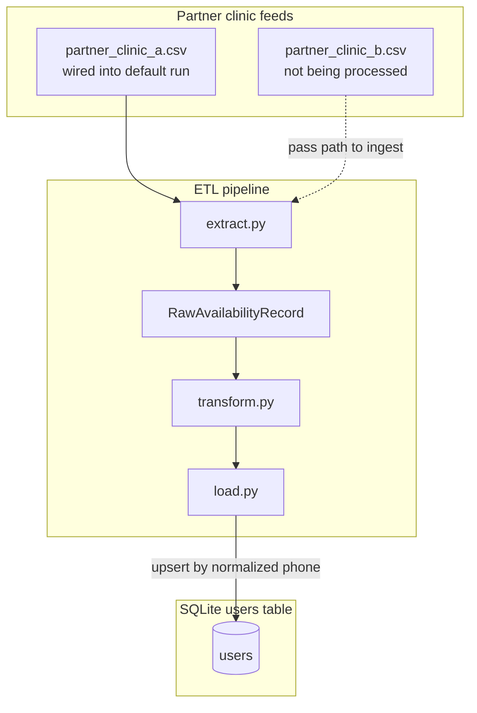

# Availability ETL

A standalone Python pipeline that ingests nurses' on-call availability schedules from our partner clinics, loading cleaned and standardized records into the `users` table:


| column       | type                                  |
| ------------ | ------------------------------------- |
| id           | UUID                                  |
| firstName    | string                                |
| lastName     | string                                |
| phoneNumber  | phoneNumber                           |
| availability | jsonb — `{ availableDays: [string] }` |


## Prereqs

- Python 3.12+
- [uv](https://docs.astral.sh/uv/)

## Data

Two partner clinic feeds live in `data/feeds/`:

1. `partner_clinic_a.csv` — `first_name`, `last_name`, `phone`, and `days`. Day segments separated by `;`.
2. `partner_clinic_b.csv` — `first_name`, `last_name`, `phone`, `timezone`, `schedule_windows`, and `blocked_dates`. Schedule windows use `Day:HH:MM-HH:MM` segments separated by `;`. Blocked dates use `start:end:reason`.

Only `partner_clinic_a.csv` is wired into the default `uv run etl` run. `partner_clinic_b.csv` is on disk but not part of that default run — pass its path explicitly to ingest it.

## Layout

```
src/etl/
  db.py         — SQLite connection + user table shell
  extract.py    — partner clinic feed parsers
  transform.py  — phone/day validation and normalization
  load.py       — upsert into `users`
  pipeline.py   — orchestrates extract → transform → load; `etl` CLI entry point
data/feeds/     — sample partner clinic feeds, git-tracked
tests/          — pytest suite
```

## Pipeline flow



Partner clinic files stay in their native shape on disk. The pipeline:

1. **Extract** (`src/etl/extract.py`) — parses each feed's rows into a common
   `RawAvailabilityRecord`, without validating or normalizing anything.
2. **Transform** (`src/etl/transform.py`) — validates and normalizes phone
   numbers and available days, rejecting rows that don't pass.
3. **Load** (`src/etl/load.py`) — upserts valid rows into `users` keyed on the
   *normalized phone number*, so re-ingesting the same feed lands as one row,
   not a duplicate.

Rows that fail validation are rejected with a reason and never written to the
table.

## Run it

```bash
uv sync --extra dev
uv run etl                                          # default: partner_clinic_a.csv
uv run etl data/feeds/partner_clinic_b.csv          # ingest the second feed explicitly
uv run pytest
```

`uv run etl` prints how many rows were staged, loaded, and rejected, plus a
reason for each rejection.
