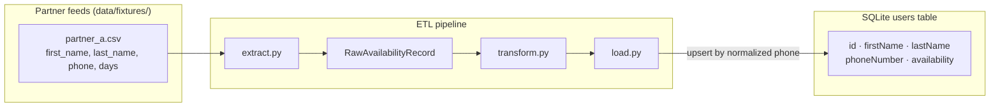

# Availability ETL

A standalone Python pipeline that ingests partner availability feeds into the
`users` table used by the [web app](../packages/README.md) (`packages/server`,
file-backed SQLite).

## Prereqs

- Python 3.12+
- [uv](https://docs.astral.sh/uv/)

## Run it

```bash
uv sync
uv run etl                          # ingests the default fixture feed
uv run etl data/fixtures/partner_b.csv   # or ingest specific files
```

It prints how many rows were staged, loaded, and rejected, plus a reason for
each rejection.

## How it fits together



Partner files stay in their native shape on disk. The pipeline parses each row
into a common `RawAvailabilityRecord`, validates and normalizes phone numbers
and available days, then upserts valid rows into `users`. Rows that fail
validation are rejected with a reason and never written to the table.

## What it does

The default run ingests `data/fixtures/partner_a.csv` — a simple partner feed
with `first_name`, `last_name`, `phone`, and `days` (`Day` segments separated
by `;`).

A second feed is also available:

- `data/fixtures/partner_b.csv` — nurse availability submitted by clinic
  practice managers (`first_name`, `last_name`, `phone`, `timezone`,
  `schedule_windows`, `blocked_dates`). Schedule windows use
  `Day:HH:MM-HH:MM` segments separated by `;`. Blocked dates use
  `start:end:reason`.

1. **Extract** (`src/etl/extract.py`) — parses each feed's rows into a common
   `RawAvailabilityRecord`, without validating or normalizing anything.
2. **Transform + load** (`src/etl/transform.py`, `src/etl/load.py::load`) —
   validates and normalizes each row (phone number, availability days),
   rejecting anything that doesn't pass, then upserts the valid rows into
   `users` keyed on the *normalized phone number* — re-ingesting the same
   feed lands as one row, not a duplicate.

## Layout

```
src/etl/
  db.py         — SQLite connection + schema
  extract.py    — partner feed parsers
  transform.py  — phone/day validation and normalization
  load.py       — validate + upsert into `users`
  pipeline.py   — orchestrates extract → load; `etl` CLI entry point
data/fixtures/  — partner feed fixtures, git-tracked
tests/          — pytest suite
```

## Commands

| Command         | What it does                             |
| --------------- | ----------------------------------------- |
| `uv run etl`    | Runs the ETL against the default fixture feed |
| `uv run pytest` | Runs the test suite                       |
